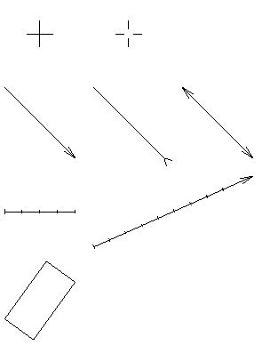

# Godot Sharp Drawing
Is set of extensions for custom drawing in Godot engine version 3.3 and higher.  

**Note: Godot currently does not support parameters 'width' and 'antialiased' of 'DrawMultiline' method so they have no effect for now.**

## Features  
  

## Setup
Add [nuget package](https://www.nuget.org/packages/GodotSharpSome.Drawing2D)
to your project.

Godot project's `.csproj` file should look like this:

```xml
<Project Sdk="Godot.NET.Sdk/3.3.0">
  <PropertyGroup>
    <TargetFramework>netcoreapp3.1</TargetFramework>
  </PropertyGroup>
  <ItemGroup>
    <PackageReference Include="GodotSharpSome.Drawing2D" Version="0.4.0" />
  </ItemGroup>
</Project>
```

## Usage
See [example project](./src/usage/) for details.