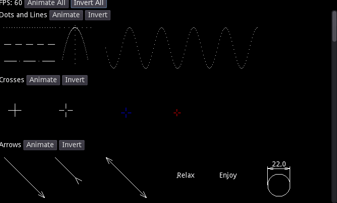
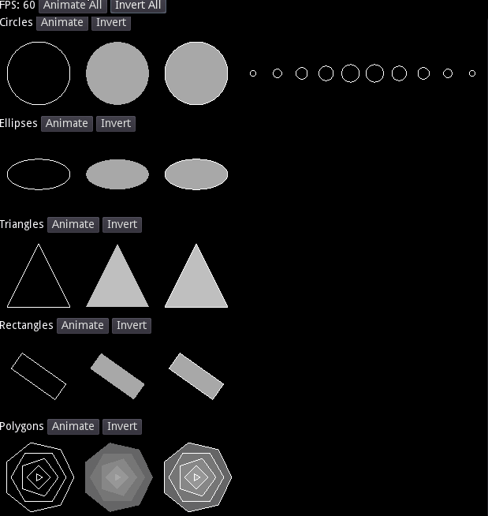

# Godot Sharp Some

[](https://www.nuget.org/packages/GodotSharpSome.Drawing2D/)

  
[](https://github.com/jirikostiha/godot-sharp-some/actions/workflows/build.yml)
[](https://github.com/jirikostiha/godot-sharp-some/actions/workflows/analyse-code.yml)
[](https://github.com/jirikostiha/godot-sharp-some/actions/workflows/lint-code.yml)
[](https://github.com/jirikostiha/godot-sharp-some/actions/workflows/lint-docs.yml)

Is set of extensions for custom drawing API in Godot engine. It simplifies script drawing.

## Features

Includes CanvasItem extensions for drawing various plane shapes and Multiline class extending possibilities of drawing API.  
List of [features](./doc/features.md).




Would you like to know [more](./src/GodotSharpSome.Drawing2D/readme.md)
and [more](./src/usage/)?

## Setup

Add [nuget package](https://www.nuget.org/packages/GodotSharpSome.Drawing2D)
to your project.

Godot project's `.csproj` file should look like this:

```xml
<Project Sdk="Godot.NET.Sdk/4.1.2">
  <PropertyGroup>
    <TargetFramework>net6.0</TargetFramework>
    <EnableDynamicLoading>true</EnableDynamicLoading>
  </PropertyGroup>
  <ItemGroup>
    <PackageReference Include="GodotSharpSome.Drawing2D" Version="X.X.X" />
  </ItemGroup>
</Project>
```

'X.X.X' is required version.

## Contributing

Any ideas, contributions and bug reports are welcome!

For new idea create an [issue](https://github.com/jirikostiha/lexicon/issues/new/choose).  
For bug report create an [issue](https://github.com/jirikostiha/lexicon/issues/new/choose).  
For contribution create a [pull request](https://docs.github.com/en/pull-requests/collaborating-with-pull-requests/proposing-changes-to-your-work-with-pull-requests/creating-a-pull-request).  

[Conventions](./doc/conventions.md)  

## License

Project is under [MIT](./LICENSE) license.
