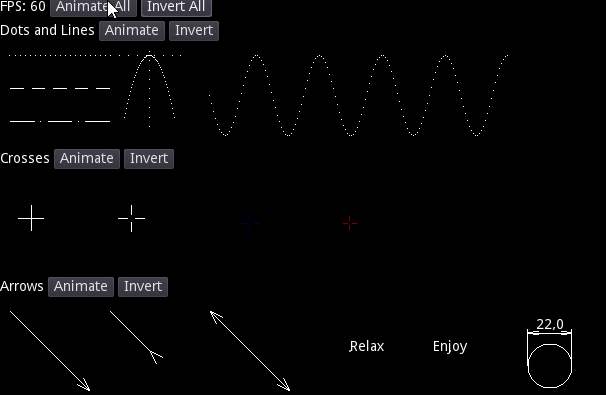
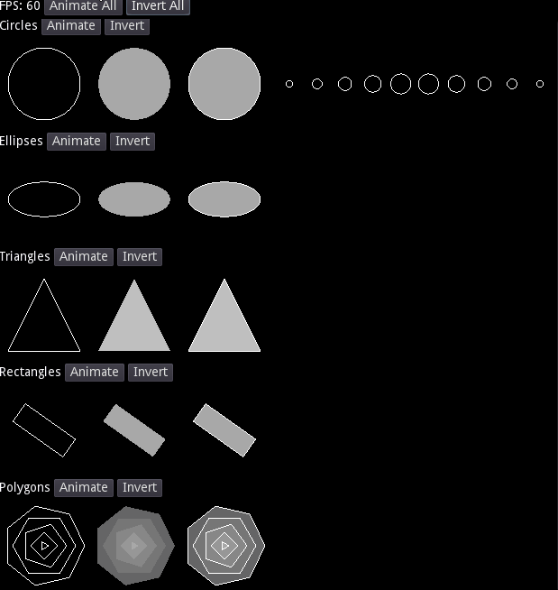

# Godot Sharp Some

<div align="center">
  
</div>

[](https://www.nuget.org/packages/GodotSharpSome.Drawing2D/)

  
[](https://github.com/jirikostiha/godot-sharp-some/actions/workflows/build.yml)
[](https://github.com/jirikostiha/godot-sharp-some/actions/workflows/analyse-code.yml)
[](https://github.com/jirikostiha/godot-sharp-some/actions/workflows/lint-code.yml)
[](https://github.com/jirikostiha/godot-sharp-some/actions/workflows/lint-docs.yml)
[](https://jirikostiha.github.io/godot-sharp-some/)

Is set of extensions for custom drawing API in [Godot engine](https://github.com/godotengine/godot). It simplifies script drawing.

## Documentation

Full API reference, guides, and performance benchmarks are available on the [Documentation Website](https://jirikostiha.github.io/godot-sharp-some/).

## Versions

| Godot .NET.Sdk | .Net           | Branch  | Version | Nuget (GodotSharpSome.) | Support         |
| :------------: | :------------: | :-----: | :-----: | :---------------------- | :-------------- |
| 4.1            | net8.0         | main    | 0.23.0  | [Drawing2D][d2d-023]    | yes             |
| 4.0            | net6.0         | main    | 0.20.0  | [Drawing2D][d2d-020]    | no              |
| 3.3            | netstandard2.0 | sdk_3.3 | 0.19.1  | [Drawing2D][d2d-019]    | bug fixing only |

[d2d-023]: https://www.nuget.org/packages/GodotSharpSome.Drawing2D/0.23.0
[d2d-020]: https://www.nuget.org/packages/GodotSharpSome.Drawing2D/0.20.0
[d2d-019]: https://www.nuget.org/packages/GodotSharpSome.Drawing2D/0.19.1

## Features

Includes CanvasItem extensions for drawing various plane shapes and Multiline class extending possibilities of drawing API.  
List of [features](./docs/features.md).




Would you like to know [more about Drawing2D](./src/GodotSharpSome.Drawing2D/readme.md)
and [see usage examples](./src/usage/)?

## Setup

Add [nuget package](https://www.nuget.org/packages/GodotSharpSome.Drawing2D)
to your project.

Godot project's `.csproj` file should look like this:

```xml
<Project Sdk="Godot.NET.Sdk/4.1.2">
  <PropertyGroup>
    <TargetFramework>net8.0</TargetFramework>
    <EnableDynamicLoading>true</EnableDynamicLoading>
  </PropertyGroup>
  <ItemGroup>
    <PackageReference Include="GodotSharpSome.Drawing2D" Version="X.X.X" />
  </ItemGroup>
</Project>
```

'X.X.X' is required version.

## Contributing

Any ideas, contributions and bug reports are welcome!

For new idea create an [issue](https://github.com/jirikostiha/godot-sharp-some/issues/new/choose).  
For bug report create an [issue](https://github.com/jirikostiha/godot-sharp-some/issues/new/choose).  
For contribution create a [pull request](https://docs.github.com/en/pull-requests/collaborating-with-pull-requests/proposing-changes-to-your-work-with-pull-requests/creating-a-pull-request).  

[Conventions](./docs/conventions.md)  

## License

Project is under [MIT](./LICENSE) license.
