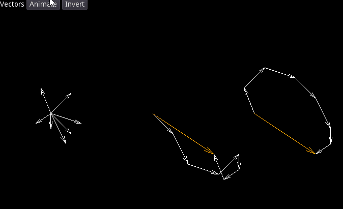

# Features

## CanvasItem Extensions

- Circle (line, perimeter, region)
- Ellipse (line, region)
- Triangle (line, region)
- Rectangle (line, region)
- Polygon (line)
- Regular convex polygon (line, region)
- Rotated string

## Multiline

Dot(s), line, parallel lines, cross, arrow, vector, triangle, rectangle, regular convex polygon, mirroring, rotating.  
All with predefined or custom line types (solid, dotted, dashed, dash-dotted).

---

## Visual Previews

### Primitives & Shapes

### Dots & Lines

### Vectors & Connections

